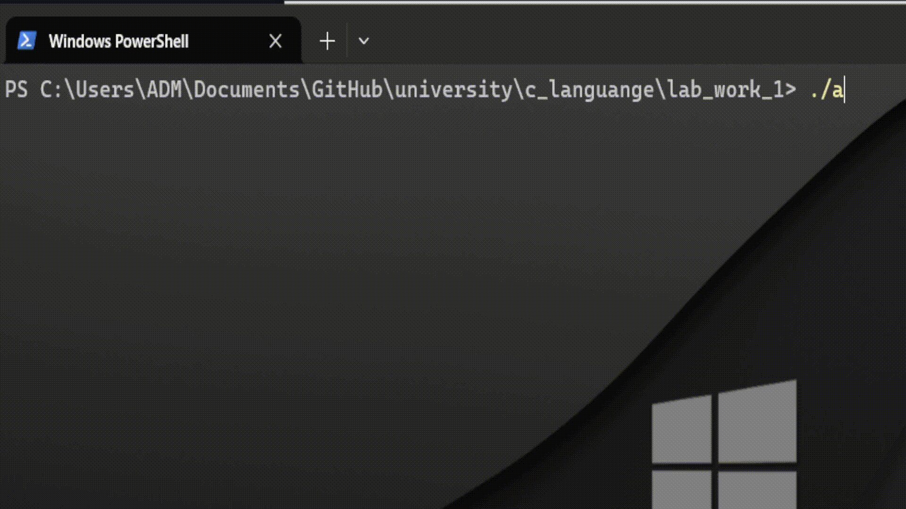

# Судоку на чистом C
В данной лабораторной работе представлен код задачи, реализующей игру судоку
## Навигация по README
- [Особенности реализации](#особенности-реализации)
- [Инструкция по установке](#инструкция-по-установке-и-сборке)
- [Инструкция по работе с игрой](#работа-с-программой-в-режиме-игры)
- [Примеры работы программы](#примеры-работы-программы)
## Инструкция по установке и сборке
Для сборки достаточно будет установить компилятор для C (например, gcc). Далее в корневой папке открываем терминал и пишем
```
gcc main.c
```
Готово! Файл собран и выбран исполняемым, достаточно запустить его командой `./a`
## Работа с программой в режиме игры
После запуска файла программа запросит у вас размерность судоку - 4х4 или 9х9, нужно ввести 4 или 9

Затем программа выведет в консоль судоку, по умолчанию выбранная ячейка будет с координатами (0, 0)

Перемещение осуществляется клавишами WASD

Для выхода из игры нажмите ESCAPE, для удаления неправильно поставленного символа - BACKSPACE, для проверки на корректность - ENTER

## Особенности реализации
### Общие особенности
- Игра полностью реализована на **чистом C**
- Весь интерфейс предоставлен в **консоли**, добавлены цветные элементы
- Тип размерности поля осуществляется при помощи `typedef short sudoku_size`
- **Размерность** поля задаётся пользователем в начале работы программы
- Используются **динамические массивы** и **нотация указателей** - *() вместо []
- Включение/выключение брутфорса через директиву `#ifndef`
- Программа предназначена для выполнения на **Windows**
- Все с-файлы обёрнуты в `#ifndef` для избежания чрезмерного включения, а так же добавлен заголовочный файл `all_sudoku_files.h`, чтобы включить все нужные библиотеки одной строчкой
- Всё поле не обновляется в консоли, так как это приводит к режущему глаз "мерцанию", вместо этого мы перемещаем каретку, меняем значения на текущих позициях

### Особенности режима игры
- Выбранная ячейка окружена квадратными скобками `[ ]`
- Если число пока что подходит на место пропуска, оно подсвечивается зелёным, иначе - красным
- Под судоку расположены подсказки по взаимодействию с игрой
- При проверке судоку на решённость выводится три сообщения - судоку решено, решено неверно, или судоку не до конца заполнено


### Особенности режима брутфорса
- Если значение подходит под ячейку, программа подсвечивает его зелёным, иначе - красным
- Пауза между подстановками реализована функцией `Sleep()`, в качестве значения передаётся значение константы `TIME_DELTA` в файле `bruteforce.c`, при желании его можно изменить

## Примеры работы программы
### Работа программы в режиме игры
 
 
### Работа программы в режиме брутфорса
 
